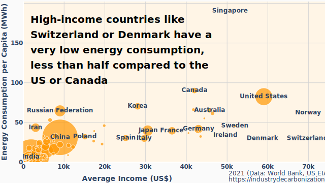

# energygraph-data

Data used to create infographics on energy vs. income.

For context, see: [Misleading Logarithmic Scales and the Disregard for Energy
Efficiency](
https://industrydecarbonization.com/news/misleading-logarithmic-scales-and-the-disregard-for-energy-efficiency.html)

[Interactive and zoomable versions can be found here](
https://industrydecarbonization.com/misc/incomeenergy.html).

## wb-income

Adjusted net national income per capita (current US$), Source: World Bank

Downloaded from https://data.worldbank.org/indicator/NY.ADJ.NNTY.PC.CD on 2024-07-11.

## wb-gdp

GDP per capita (current US$), Source: World Bank

Downloaded from https://data.worldbank.org/indicator/NY.GDP.PCAP.CD on 2024-07-11.

## wb-population

Population, total, Source: World Bank

Downloaded from https://data.worldbank.org/indicator/SP.POP.TOTL on 2024-07-11.

## eia

International Energy Data, Source: US EIA

Downloaded from https://www.eia.gov/opendata/ on 2024-07-11.

## license / copyright

World Bank data is licensed as [CC BY-4.0](
https://creativecommons.org/licenses/by/4.0/).

US EIA data is in the [public domain](https://www.eia.gov/about/copyrights_reuse.php).
